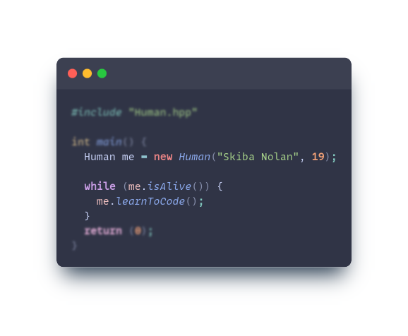

#  Hello, World!
I'm [Nolan Skiba](https://www.linkedin.com/in/nolan-skiba-35b3b8279/), a 19-year-old French student at [42](http://42angouleme.fr/). I began coding when I was 15, primarily focusing on Java programming and web development.

I have a strong passion for continuous learning in order to enhance my skills as a developer. I constantly strive to improve my code and workflow. I currently use [Ubuntu](https://ubuntu.com/download) as my operating system.

If you want to know more about me, feel free to explore my repositories and projects.
#

> **My languages**

> **Technologies, Frameworks & Tools**

  
  

#

 
